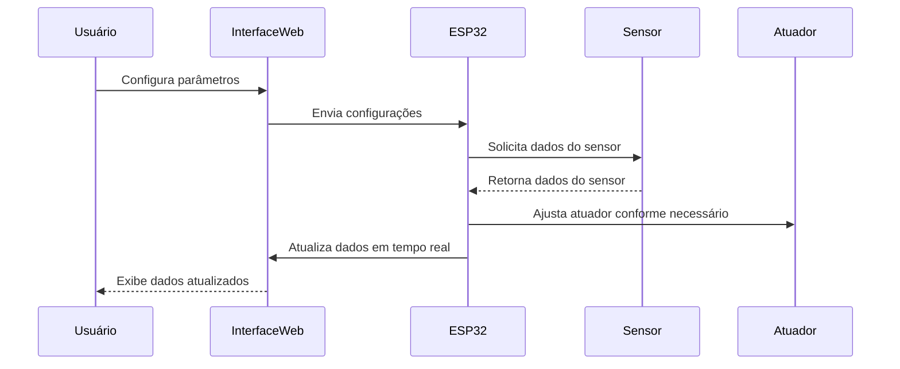
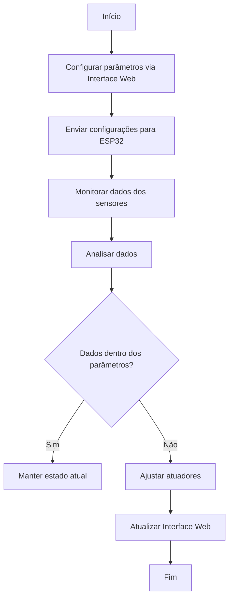
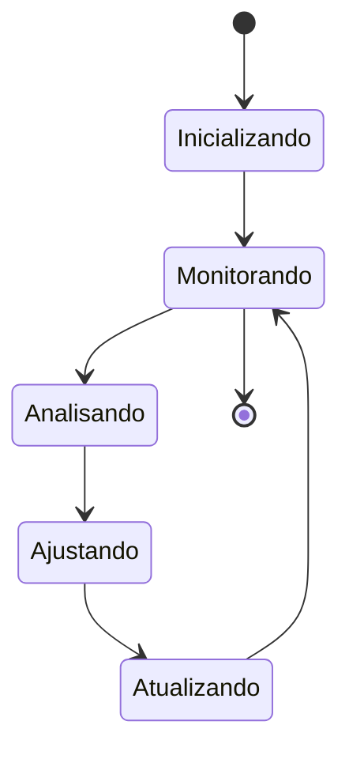
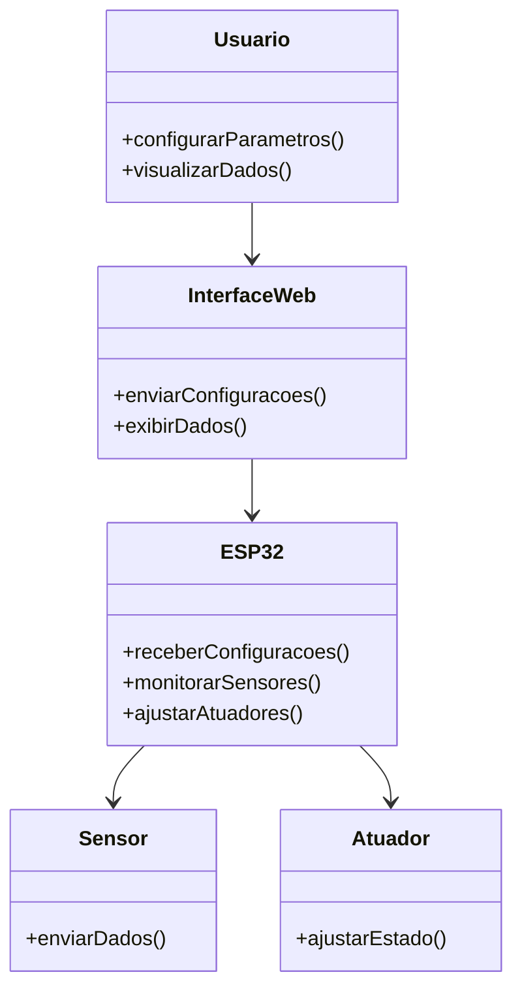
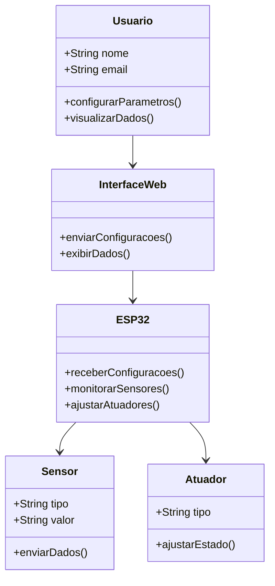
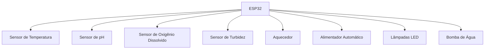
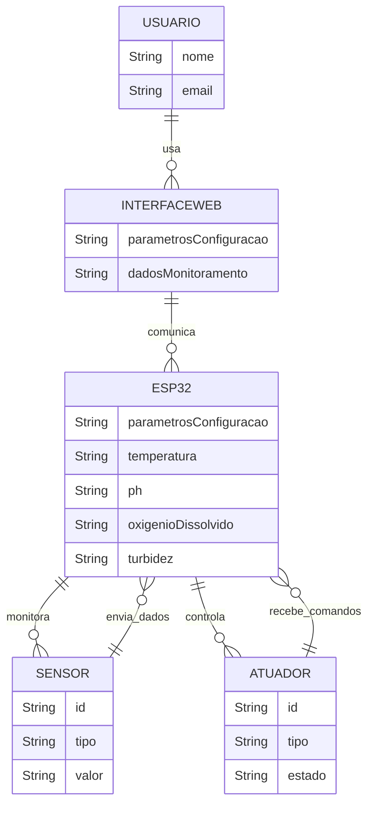
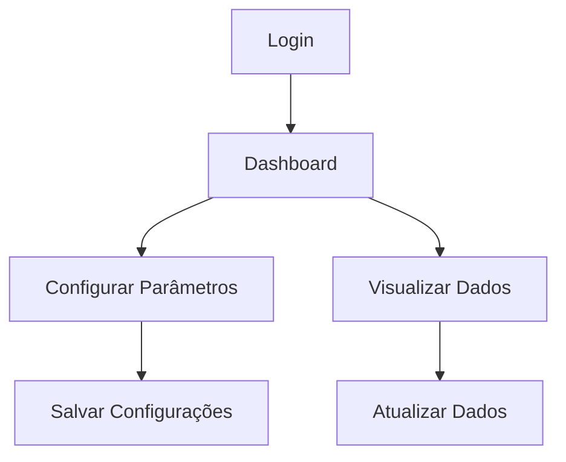

## Apresentação do Projeto - Parte 2 (10/12/2024 - 10/12/2024)

## Introdução

Este relatório descreve a modelagem do banco de dados para o "Projeto de Aquário Inteligente". O objetivo deste projeto é criar um sistema que monitore e controle parâmetros do ambiente de um aquário, como temperatura, pH, usando sensores e atuadores. A modelagem de banco de dados visa garantir a estruturação eficiente e segura dos dados coletados pelo sistema, permitindo análise em tempo real e controle automatizado do aquário.

## Diagrama Entidade-Relacionamento (ER)

A modelagem foi realizada utilizando o Diagrama Entidade-Relacionamento (ER), que descreve as entidades principais do sistema e os relacionamentos entre elas.

### Entidades:

1. **Sensor**
   - Atributos:
     - `sensor_id`: Identificador único do sensor.
     - `tipo`: Tipo de sensor (temperatura, pH, oxigênio).
     - `valor`: Valor medido pelo sensor.
     - `data_hora`: Data e hora da medição.
   - Relacionamento:
     - Cada sensor registra múltiplos valores de medição, formando um relacionamento de um-para-muitos com a entidade "Leitura".

2. **Leitura**
   - Atributos:
     - `leitura_id`: Identificador único da leitura.
     - `sensor_id`: Chave estrangeira para a entidade "Sensor".
     - `valor`: Valor da medição no momento da leitura.
     - `data_hora`: Data e hora da leitura.

3. **Dispositivo**
   - Atributos:
     - `dispositivo_id`: Identificador único do dispositivo.
     - `tipo`: Tipo de dispositivo (exemplo: bomba, luz, etc.).
     - `status`: Status do dispositivo (ligado/desligado).
   - Relacionamento:
     - Os dispositivos estão associados ao "Controle", que registra as ações realizadas sobre eles.

4. **Controle**
   - Atributos:
     - `controle_id`: Identificador único do controle.
     - `dispositivo_id`: Chave estrangeira para a entidade "Dispositivo".
     - `acao`: Ação realizada (ligar, desligar, ajustar).
     - `data_hora`: Data e hora da ação.

5. **Aquário**
   - Atributos:
     - `aquario_id`: Identificador único do aquário.
     - `nome`: Nome do aquário.
     - `localizacao`: Localização física do aquário.
   - Relacionamento:
     - O aquário pode ter múltiplos dispositivos e sensores associados.

### Relacionamentos:

- **Sensor** (1:N) **Leitura**: Um sensor pode registrar várias leituras, mas cada leitura está associada a um único sensor.
- **Dispositivo** (1:N) **Controle**: Um dispositivo pode ter múltiplas ações de controle, mas cada ação é vinculada a um único dispositivo.
- **Aquário** (1:N) **Sensor** e **Aquário** (1:N) **Dispositivo**: Um aquário pode ter múltiplos sensores e dispositivos, mas cada sensor ou dispositivo pertence a um único aquário.

## Modelo Relacional

Com base no Diagrama ER, o modelo relacional do banco de dados foi estruturado da seguinte forma:

### Tabelas:

1. **Sensor**
   ```sql
   CREATE TABLE Sensor (
       sensor_id INT PRIMARY KEY,
       tipo VARCHAR(50),
       valor DECIMAL(5, 2),
       data_hora TIMESTAMP
   );
   ```

2. **Leitura**
   ```sql
   CREATE TABLE Leitura (
       leitura_id INT PRIMARY KEY,
       sensor_id INT,
       valor DECIMAL(5, 2),
       data_hora TIMESTAMP,
       FOREIGN KEY (sensor_id) REFERENCES Sensor(sensor_id)
   );
   ```

3. **Dispositivo**
   ```sql
   CREATE TABLE Dispositivo (
       dispositivo_id INT PRIMARY KEY,
       tipo VARCHAR(50),
       status VARCHAR(20)
   );
   ```

4. **Controle**
   ```sql
   CREATE TABLE Controle (
       controle_id INT PRIMARY KEY,
       dispositivo_id INT,
       acao VARCHAR(50),
       data_hora TIMESTAMP,
       FOREIGN KEY (dispositivo_id) REFERENCES Dispositivo(dispositivo_id)
   );
   ```

5. **Aquário**
   ```sql
   CREATE TABLE Aquario (
       aquario_id INT PRIMARY KEY,
       nome VARCHAR(100),
       localizacao VARCHAR(100)
   );
   ```

### Relacionamentos entre Tabelas:

- **Sensor** e **Leitura**: O campo `sensor_id` em "Leitura" é uma chave estrangeira que referencia `sensor_id` em "Sensor".
- **Dispositivo** e **Controle**: O campo `dispositivo_id` em "Controle" é uma chave estrangeira que referencia `dispositivo_id` em "Dispositivo".
- **Aquário** com **Sensor** e **Dispositivo**: Ambas as entidades têm relação de um-para-muitos com "Aquário".


### 
Diagramas:
- Sequência
- Atividades
- Máquina de Estados
- Casos de uso
- Classes
- Blocos
- Entidade & Relacionamento (E&R)
- Protótipo do aplicativo/aplicação (design das telas)
- Outros 
Diagramas

Diagrama de Sequência



Diagrama de Atividades



Diagrama de Máquina de Estados



Diagrama de Casos de Uso



Diagrama de Classes



Diagrama de Blocos



Diagrama Entidade & Relacionamento (E&R)



Protótipo do Aplicativo/Aplicação (Design das Telas)



## Conclusão

A modelagem do banco de dados para o "Projeto de Aquário Inteligente" foi estruturada de forma a garantir a integração eficiente dos dados de sensores e dispositivos de controle. As tabelas e relacionamentos foram definidos para suportar as funcionalidades do sistema, como o monitoramento de condições ambientais e o controle automático do aquário. Este modelo de banco de dados permitirá análises precisas e a automação do sistema de aquário inteligente, garantindo a operação contínua e segura.

## Próximos Passos

- Implementação do banco de dados conforme o modelo relacional.
- Desenvolvimento das interfaces de integração entre os sensores e o banco de dados.
- Testes e ajustes para garantir a performance e a escalabilidade do sistema.
