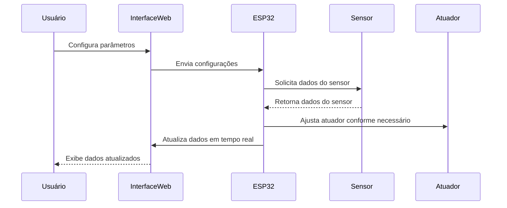
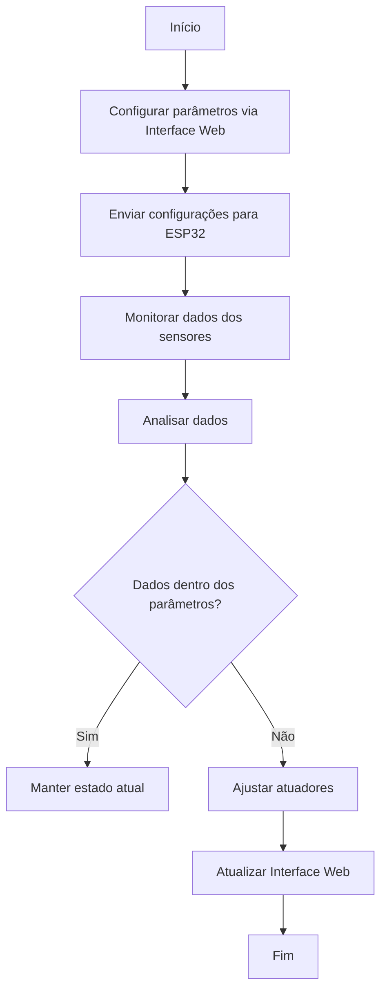
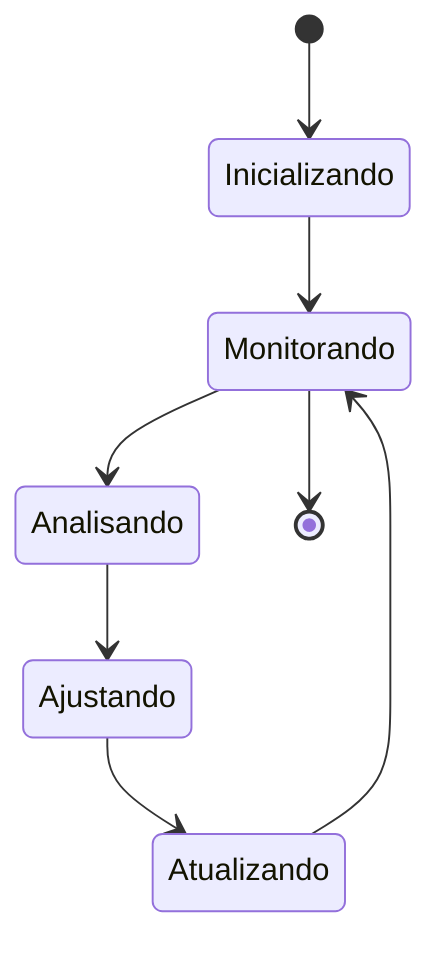
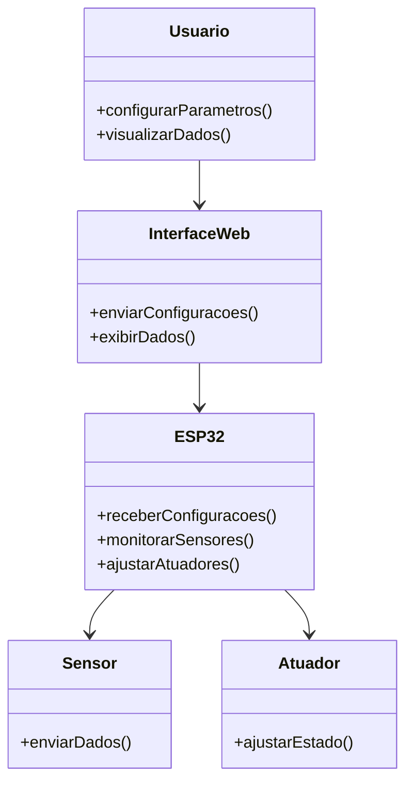
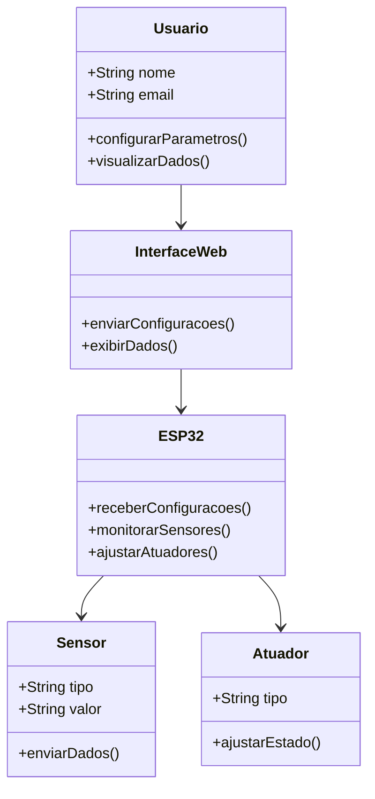
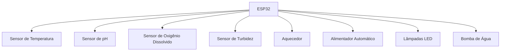
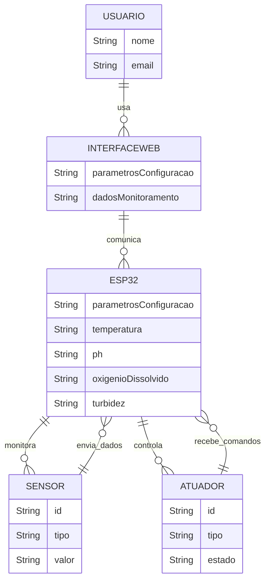
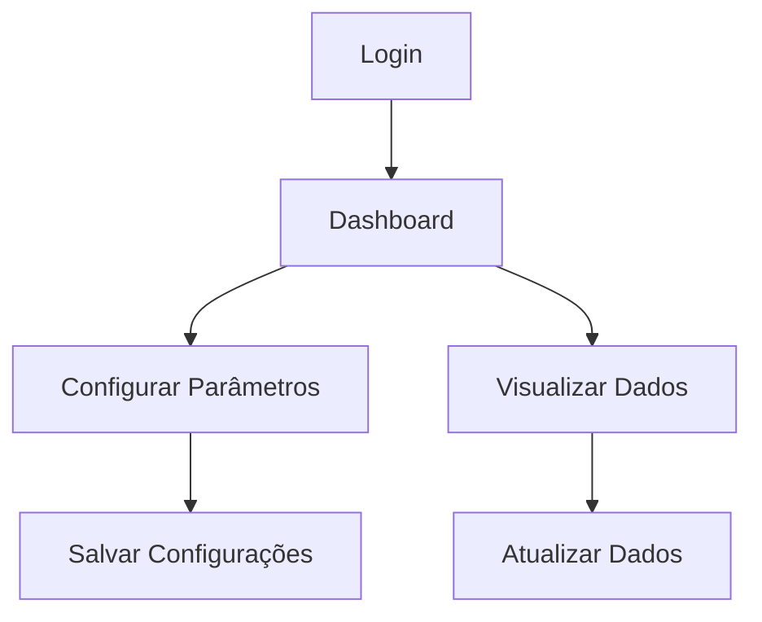

# Projeto de Aquário Inteligente

## Apresentação do Projeto - Parte 1 (03/12/2024 - 03/12/2024)

## Introdução
Este projeto tem como objetivo desenvolver um aquário inteligente que automatize o controle de temperatura, alimentação dos peixes, iluminação e monitoramento da qualidade da água.

## Objetivos
- Automatizar o controle de temperatura da água.
- Automatizar a alimentação dos peixes.
- Controlar a iluminação do aquário.
- Monitorar a qualidade da água (pH, amônia, nitrito, nitrato).

## Componentes Necessários
- Sensores de temperatura
- Sensores de pH
- Sensores de amônia, nitrito e nitrato
- Atuadores para controle de alimentação
- LEDs para iluminação
- Microcontrolador (ex: ESP32)
- Bomba de água
- Aquecedor de água

## Metodologia
1. **Planejamento**: Definir os requisitos do sistema e selecionar os componentes necessários.
2. **Desenvolvimento de Hardware**: Montar os sensores e atuadores no aquário.
3. **Desenvolvimento de Software**: Programar o microcontrolador para controlar os sensores e atuadores.
4. **Integração**: Integrar o hardware e o software e realizar testes.
5. **Validação**: Validar o funcionamento do sistema e ajustar conforme necessário.

## Introdução/Motivação
  A manutenção de aquários requer atenção constante a diversos fatores ambientais que influenciam a saúde dos peixes e a qualidade da água. A automação desses processos pode reduzir a carga de trabalho dos donos de aquarios e melhorar as condições de vida dos organismos aquáticos. Este projeto visa a criação de um aquário inteligente que automatiza o controle de temperatura, alimentação dos peixes, iluminação e monitoramento da qualidade da água. A implementação de tecnologias de automação e monitoramento em aquários não apenas melhora a experiência do aquarista, mas também contribui para a saúde e bem-estar dos organismos aquáticos.
## Descrição da Proposta
  - Este projeto visa desenvolver um aquário inteligente que automatiza o controle de temperatura, alimentação dos peixes, iluminação e monitoramento da qualidade da água. A proposta inclui a integração de sensores, atuadores e um microcontrolador para criar um sistema autônomo que melhora a experiência do aquarista e a saúde dos organismos aquáticos.
## Especificação
### Detalhes do Sistema
  - **Hardware:**
    - **Plataformas:** ESP32
    - **Sensores:** Sensor de temperatura (DS18B20), sensor de pH, sensor de oxigênio dissolvido, sensor de turbidez
    - **Atuadores:** Aquecedor, alimentador automático, lâmpadas LED
    - **Outros componentes:** Bomba de água
  - **Software:**
    - Linguagens de programação: Arduino (.ino) para o ESP32
    - Interface de usuário: Desenvolvida em React para visualização dos dados em tempo real e configuração dos parâmetros do aquário
    - Algoritmos de controle para automatizar a alimentação, ajustar a temperatura e a iluminação com base nas leituras dos sensores

## Requisitos Funcionais e Não Funcionais
  - **Requisitos Funcionais:**
    - Monitorar a temperatura, pH, oxigênio dissolvido e turbidez da água
    - Controlar automaticamente a alimentação dos peixes
    - Manter a temperatura da água dentro de uma faixa ideal
  - **Requisitos Não Funcionais:**
    - O sistema deve ser confiável e operar continuamente sem falhas
    - A interface de usuário deve ser intuitiva e fácil de usar
    - O sistema deve ser escalável para permitir a adição de novos sensores e atuadores no futuro

- **Trabalhos/Projeto/Produtos relacionados**=
## Principais Características dos Aquários Inteligentes

# Visão Abrangente de Trabalhos, Projetos e Produtos Relacionados a Aquários Inteligentes

Os aquários inteligentes representam um avanço significativo na tecnologia de aquários, integrando inovações de ponta para melhorar a gestão e manutenção de ambientes aquáticos. Esta visão geral explorará vários aspectos dos aquários inteligentes, incluindo características principais, produtos existentes, projetos em andamento e o panorama da indústria.

### Principais Características e Tecnologias
1. **Monitoramento e Controle Remoto**
2. **Sistemas de Alimentação Automatizados**
3. **Sistemas de Iluminação Inteligente**
4. **Monitoramento da Qualidade da Água**
5. **Filtragem e Gestão da Água**
6. **Integração com Dispositivos de Casa Inteligente**
7. **Registro e Análise de Dados**
8. **Cuidados Preventivos de Saúde**
9. **Integração com Wi-Fi**

## Produtos de Aquários Inteligentes Existentes no Mercado

- **Felix Smart**: Oferece uma gama de produtos que permitem aos usuários monitorar e gerenciar seus aquários remotamente. Seus sistemas incluem recursos como uma câmera submersível de 360 graus e sensores integrados para monitoramento abrangente do tanque.
- **OASE**: Conhecida por seus monitores de qualidade da água, alimentadores automáticos e sistemas de iluminação, a OASE oferece designs amigáveis e tecnologia avançada para mercados domésticos e internacionais.
- **Petkit**: Especializa-se em sistemas de alimentação inteligentes, monitores de qualidade da água e soluções de iluminação, aproveitando sua expertise em tecnologia para animais de estimação para oferecer soluções confiáveis para entusiastas de aquários.
- **MOAI Robot**: Este dispositivo automatiza a limpeza do tanque, permitindo que os usuários o controlem via smartphone e assistam a transmissões ao vivo do processo de limpeza.
- **Seneye**: Fornece um sistema de alerta que monitora a temperatura do tanque, nível da água, pH e níveis de NH3, ajudando a prevenir que pequenas mudanças se tornem problemas significativos.
- **GHL Doser**: Projetado para tanques de água salgada e recifes, este dispositivo automatiza a dosagem de elementos traço e nutrientes, mantendo a química da água estável.

## Projetos e Inovações em Andamento

1. **Manutenção e Monitoramento Automatizados**: Projetos aprimoram funções como alimentação e circulação de água usando microcontroladores STM32 para melhor resposta e controle.

2. **Tecnologias Avançadas de Sensores**: Sensores como DS18B20 e BH1750 permitem monitoramento preciso de temperatura e luz, melhorando o controle do ambiente do aquário.

3. **Integração com IA e Aprendizado de Máquina**: IA e aprendizado de máquina são usados para prever e automatizar respostas a mudanças no ambiente do aquário, aumentando a eficiência.

4. **Sustentabilidade e Eficiência Energética**: Foco em microcontroladores de baixo consumo e protocolos de comunicação eficientes para reduzir o consumo de energia e manter alto desempenho.

## Cronograma
| Etapa                | Descrição                                      | Duração |
|----------------------|------------------------------------------------|---------|
| Planejamento         | Definição de requisitos e seleção de componentes | 1 semana |
| Desenvolvimento de Hardware | Montagem dos sensores e atuadores         | 1 semana |
| Desenvolvimento de Software | Programação do microcontrolador            | 1 semana |
| Integração e Validação | Integração, testes e ajustes                   | 1 semana |

## Referências

A Peek into Advanced Aquarium Automation: Maximizing Efficiency and Well-Being with Smart Aquarium Technology. Disponível em: <https://fishtanksdirect.com/blog/smart-aquarium-technology/>. Acesso em: 15 nov. 2024.

FU, S. et al. Research and design of an intelligent fish tank system. v. 18, n. 5, p. e0285105–e0285105, 4 maio 2023.

RAMAIAH, N. et al. Fish Tank Monitoring System Using IoT. International Journal of Scientific Research in Science and Technology, p. 298–304, 25 maio 2020.

S, B. et al. Smart Aquarium Management System. Intelligent Systems and Computer Technology, 10 nov. 2020.

“Smart” Tank Technology is the Future of the Aquarium Hobby. Disponível em: <https://www.ratemyfishtank.com/blog/smart-tank-technology-is-the-future-of-the-aquarium-hobby>.

SOPIAN, Z. et al. Aquatic Life Monitoring Using Raspberry-Pi in Internet of Things (IoT). 2022 IEEE Symposium on Future Telecommunication Technologies (SOFTT), p. 90–96, 14 nov. 2022.

TOBACK, M. The Ultimate Guide to Wi-Fi Aquarium Setup and Benefits. Disponível em: <https://medium.com/@michael.toback/the-ultimate-guide-to-wi-fi-aquarium-setup-and-benefits-4a69a1b5e294>. Acesso em: 15 nov. 2024.

## Apresentação do Projeto - Parte 2 (10/12/2024 - 10/12/2024)

### 
Diagramas:
- Sequência
- Atividades
- Máquina de Estados
- Casos de uso
- Classes
- Blocos
- Entidade & Relacionamento (E&R)
- Protótipo do aplicativo/aplicação (design das telas)
- Outros 
Diagramas

Diagrama de Sequência

Diagrama de Atividades

Diagrama de Máquina de Estados

Diagrama de Casos de Uso

Diagrama de Classes

Diagrama de Blocos

Diagrama Entidade & Relacionamento (E&R)

Protótipo do Aplicativo/Aplicação (Design das Telas)

### Obrigatórios:
- Blocos (para modelagem do hardware)
- Sequência ou Atividades ou Máquina de estados: pelo menos um deles para representar o comportamento do sistema
- E&R (se tiver banco de dados no projeto)
- Protótipo do aplicativo/aplicação

### Para a apresentação da modelagem:
- Refinar os Requisitos Funcionais e Não Funcionais

### Modelo:

https://wokwi.com/projects/414666125270216705

src/
  components/
    Dashboard.js
    Login.js
    ConfigureParameters.js
    ViewData.js
  App.js
  index.js

  #include <WiFi.h>
#include <PubSubClient.h>
#include <OneWire.h>
#include <DallasTemperature.h>

// Definições de pinos
#define ONE_WIRE_BUS 4  // Pino para o sensor de temperatura DS18B20
#define PH_PIN 34       // Pino para o sensor de pH
#define OXYGEN_PIN 35   // Pino para o sensor de oxigênio dissolvido
#define TURBIDITY_PIN 32 // Pino para o sensor de turbidez
#define HEATER_PIN 26   // Pino para o aquecedor
#define FEEDER_PIN 27   // Pino para o alimentador automático
#define LED_PIN 25      // Pino para as lâmpadas LED
#define PUMP_PIN 33     // Pino para a bomba de água

// Configurações de Wi-Fi
const char* ssid = "SEU_SSID";
const char* password = "SUA_SENHA";

// Configurações do MQTT
const char* mqtt_server = "mqtt.seu-servidor.com";
const char* mqtt_user = "seu_usuario";
const char* mqtt_password = "sua_senha";
const char* temperature_topic = "aquario/temperatura";
const char* ph_topic = "aquario/ph";
const char* oxygen_topic = "aquario/oxigenio";
const char* turbidity_topic = "aquario/turbidez";

// Configuração do sensor de temperatura
OneWire oneWire(ONE_WIRE_BUS);
DallasTemperature sensors(&oneWire);

WiFiClient espClient;
PubSubClient client(espClient);

void setup() {
  Serial.begin(115200);
  sensors.begin();

  // Configuração dos pinos
  pinMode(PH_PIN, INPUT);
  pinMode(OXYGEN_PIN, INPUT);
  pinMode(TURBIDITY_PIN, INPUT);
  pinMode(HEATER_PIN, OUTPUT);
  pinMode(FEEDER_PIN, OUTPUT);
  pinMode(LED_PIN, OUTPUT);
  pinMode(PUMP_PIN, OUTPUT);

  // Conexão Wi-Fi
  WiFi.begin(ssid, password);
  while (WiFi.status() != WL_CONNECTED) {
    delay(1000);
    Serial.println("Conectando ao WiFi...");
  }
  Serial.println("Conectado ao WiFi");

  // Conexão MQTT
  client.setServer(mqtt_server, 1883);
  while (!client.connected()) {
    Serial.println("Conectando ao MQTT...");
    if (client.connect("ESP32Client", mqtt_user, mqtt_password)) {
      Serial.println("Conectado ao MQTT");
    } else {
      Serial.print("Falha na conexão MQTT, rc=");
      Serial.print(client.state());
      delay(2000);
    }
  }
}

void loop() {
  if (!client.connected()) {
    while (!client.connected()) {
      Serial.println("Reconectando ao MQTT...");
      if (client.connect("ESP32Client", mqtt_user, mqtt_password)) {
        Serial.println("Reconectado ao MQTT");
      } else {
        Serial.print("Falha na reconexão MQTT, rc=");
        Serial.print(client.state());
        delay(2000);
      }
    }
  }
  client.loop();

  // Leitura dos sensores
  sensors.requestTemperatures();
  float temperature = sensors.getTempCByIndex(0);
  float ph = analogRead(PH_PIN) * (5.0 / 4095.0);
  float oxygen = analogRead(OXYGEN_PIN) * (5.0 / 4095.0);
  float turbidity = analogRead(TURBIDITY_PIN) * (5.0 / 4095.0);

  // Controle dos atuadores
  if (temperature < 24.0) {
    digitalWrite(HEATER_PIN, HIGH);
  } else {
    digitalWrite(HEATER_PIN, LOW);
  }

  // Publicação dos dados no MQTT
  client.publish(temperature_topic, String(temperature).c_str());
  client.publish(ph_topic, String(ph).c_str());
  client.publish(oxygen_topic, String(oxygen).c_str());
  client.publish(turbidity_topic, String(turbidity).c_str());

  // Intervalo de leitura e envio
  delay(60000); // 1 minuto
}

curl -X POST http://localhost:3001/data -H "Content-Type: application/json" -d '{"temperature": 25.5, "ph": 7.2, "oxygen": 8.1, "turbidity": 2.5}'

